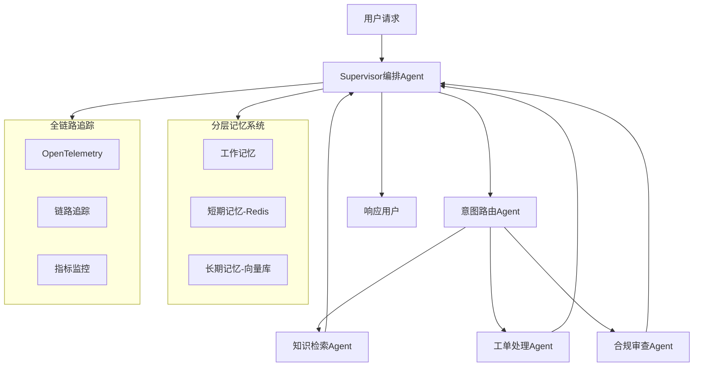

# 智能客服多Agent系统 — 企业级面试项目全攻略

## 一、调研结论：业界主流方案

### 1.1 参考的企业级开源项目

| 项目 | Stars | 语言 | 核心特点 |
|------|-------|------|----------|
| AWS Agent Squad (awslabs/agent-squad) | 7,500+ | Python/TypeScript | 智能意图分类+SupervisorAgent编排+电商客服示例 |
| LangGraph Supervisor (langchain-ai/langgraph-supervisor-py) | 1,500+ | Python | Supervisor模式预构建库, 月下载63万+ |
| Spring AI Alibaba (alibaba/spring-ai-alibaba) | 9,000+ | Java | 多Agent编排(Sequential/Parallel/Routing/Loop), 管理后台可视化 |
| Eino (cloudwego/eino) | 10,300+ | Go (字节跳动) | Supervisor/Plan-Execute模式, 企业级状态管理 |
| Multi-Agent Enterprise CRM (Mrgig7) | - | Python | LangGraph+Kafka+Next.js, 销售/支持/合规Agent, 多租户+GDPR |
| SwarmAI (intelliswarm-ai/swarm-ai) | - | Java | Spring AI 1.0.4, 自改进工作流+检查点持久化 |

### 1.2 技术选型决策

**核心架构采用 Supervisor 编排模式（中心化协调）**，这是金融/电商客服场景下的最佳实践：



## 二、项目结构设计（三语言实现）

```
smart-cs-multi-agent/
├── README.md                          # 项目总览
├── docs/
│   ├── architecture.md                # 架构设计文档
│   ├── code-walkthrough.md            # 代码讲解文档
│   ├── deployment.md                  # 部署指南
│   ├── project-plan.md               # 本文件（调研与规划）
│   └── interview/
│       ├── resume-template.md         # 简历模板
│       ├── star-method.md             # STAR法则面试话术
│       ├── baguwen.md                 # 八股文题库+答案
│       └── project-qa.md             # 项目问答模拟
│
├── python-impl/                       # Python实现 (LangGraph)
│   ├── agents/
│   │   ├── supervisor.py              # Supervisor编排Agent
│   │   ├── intent_router.py           # 意图路由Agent
│   │   ├── knowledge_rag.py           # 知识检索Agent (RAG)
│   │   ├── ticket_handler.py          # 工单处理Agent
│   │   └── compliance_checker.py      # 合规审查Agent
│   ├── memory/
│   │   ├── working_memory.py          # 工作记忆
│   │   ├── short_term.py              # 短期记忆(Redis)
│   │   └── long_term.py              # 长期记忆(向量库)
│   ├── mcp/                           # MCP工具协议
│   │   └── mcp_server.py
│   ├── tracing/                       # OpenTelemetry追踪
│   │   └── otel_config.py
│   ├── api/                           # FastAPI接口
│   │   └── main.py
│   ├── requirements.txt
│   ├── Dockerfile
│   └── .env.example
│
├── java-impl/                         # Java实现 (Spring AI)
│   ├── src/main/java/com/smartcs/
│   │   ├── agent/                     # Agent实现
│   │   ├── memory/                    # 分层记忆
│   │   ├── mcp/                       # MCP集成
│   │   ├── tracing/                   # 追踪
│   │   └── config/                    # 配置+Controller
│   ├── pom.xml
│   └── Dockerfile
│
├── go-impl/                           # Go实现 (Gin + 原生并发)
│   ├── agent/                         # Agent实现
│   ├── memory/                        # 分层记忆
│   ├── mcp/                           # MCP集成
│   ├── tracing/                       # 追踪
│   ├── api/                           # HTTP服务
│   ├── go.mod
│   ├── main.go
│   └── Dockerfile
│
└── docker-compose.yml                 # 一键启动全部服务
```

## 三、核心技术亮点（面试重点）

### 3.1 Supervisor编排模式
- Supervisor作为中央协调者，接收用户请求后决定分发给哪个子Agent
- 支持并行调用多个Agent（如同时查知识库+检查合规）
- 实现 Human-in-the-Loop 断点，敏感操作需人工审批

### 3.2 分层记忆系统
- **工作记忆**：当前对话的中间推理状态（存于Agent State，进程内，零延迟）
- **短期记忆**：最近N轮对话上下文（Redis, TTL 30分钟，滑动窗口淘汰）
- **长期记忆**：用户画像+历史工单+知识库（向量数据库 FAISS/Milvus，持久化）

### 3.3 MCP工具协议
- 遵循 Model Context Protocol 标准，Agent通过 JSON-RPC 2.0 调用外部工具
- 工具包括：订单查询、工单创建、知识库搜索、风控接口
- 统一工具注册/发现机制（tools/list + tools/call），支持动态扩展

### 3.4 全链路追踪
- OpenTelemetry 标准集成，每个Agent调用生成 Span
- 追踪链路：用户请求 → Supervisor → 子Agent → 工具调用 → 响应
- 关键指标：延迟、Token消耗、Agent路由准确率、工具调用成功率

### 3.5 合规审查（金融场景）
- 两阶段机制：规则引擎毫秒级快筛 + LLM深度审查
- 检查维度：敏感词、PII泄露、越权承诺、违规金融用语
- 规则引擎保底（召回率>99%），LLM提升精确率（>95%）

## 四、面试准备材料

### 4.1 简历项目经历模板（STAR法则）

**项目名称**：智能客服多Agent系统

**S（情境）**：公司客服系统面临日均10万+咨询量，人工客服响应慢（平均30分钟），知识库分散导致回答不一致，合规风险缺乏自动化审查。

**T（任务）**：作为核心开发者，负责设计并实现基于多Agent架构的智能客服系统，目标将首问解决率(FCR)从65%提升至80%+，响应时间降至秒级。

**A（行动）**：
- 设计 Supervisor 编排架构，实现意图路由/知识检索/工单处理/合规审查4个专业Agent
- 构建三层记忆系统（工作记忆+Redis短期记忆+Milvus长期记忆），解决多轮对话上下文丢失问题
- 集成 MCP 工具协议实现标准化工具调用，降低工具集成成本60%
- 基于 OpenTelemetry 搭建全链路追踪，实现Agent调用链路可视化和异常告警

**R（结果）**：
- 首问解决率从65%提升到82%，客户满意度从4.3提升到4.7
- 平均响应时间从30分钟降至3秒，日处理能力提升20倍
- Token消耗通过分层记忆+缓存策略降低40%
- 合规风险事件减少95%

### 4.2 八股文核心题目（详见 docs/interview/baguwen.md）

覆盖32道高频题目：
- 单Agent vs 多Agent的选型依据是什么？
- Supervisor模式 vs Peer-to-Peer模式的优劣？
- ReAct框架原理？Tool Use的实现机制？
- RAG的完整流程？文档分块策略对比？
- 向量数据库选型（FAISS vs Milvus vs Pinecone）？
- 分层记忆系统如何设计？短期记忆淘汰策略？
- MCP协议与传统API调用的区别？
- OpenTelemetry在Agent系统中如何埋点？
- 多Agent间的冲突解决机制？
- Agent的幻觉检测与自我纠正？
- 如何做Agent系统的压测和性能优化？
- Human-in-the-Loop的实现原理？

### 4.3 项目问答模拟（详见 docs/interview/project-qa.md）

12个深度面试追问+标准回答：
- "为什么选择Supervisor模式而不是去中心化？"
- "分层记忆的三层是怎么协作的？缓存击穿怎么处理？"
- "如果一个Agent超时了，Supervisor怎么处理？"
- "合规审查Agent的误判率怎么控制？"
- "系统QPS能到多少？瓶颈在哪里？"
- "你的Supervisor编排和简单的if-else路由有什么区别？"
- "RAG检索的准确率怎么评估？"
- "Go版本和Python版本有什么性能差异？"

## 五、三语言实现对比

| 维度 | Python (LangGraph) | Java (Spring AI) | Go (原生+Gin) |
|------|-------------------|-----------------|--------------|
| 编排模型 | LangGraph StateGraph | Agent接口+组合模式 | goroutine+struct |
| 状态管理 | TypedDict + Checkpoint | POJO类 | 结构体指针 |
| 并发能力 | asyncio协程 | CompletableFuture | goroutine真并行 |
| 适合团队 | AI/数据团队 | 企业级Java团队 | Go微服务团队 |
| 单机QPS | 50-100（LLM瓶颈） | 200-500 | 500-2000 |
| 内存占用 | ~200MB | ~300MB | ~30MB |

## 六、安全注意事项

**重要**：项目中不包含任何真实的API Key、Token或密码。所有敏感配置通过环境变量注入，`.env.example`仅提供占位符示例。请勿将真实凭据提交到版本控制系统。
